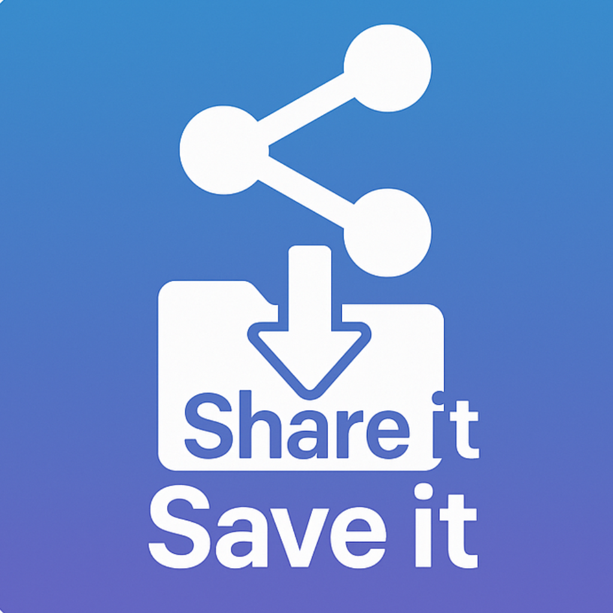

# 🚀 **Share It Save It**

  

  <strong>Save and organize social media links in seconds — all stored locally on your device.</strong> 
  A lightweight iOS app built for quick bookmarking, clean organization, and total privacy.

---

## 🌐 **Live Website**
👉 **https://shareitsaveit.netlify.app/**

---

## 🍎 **App Store Link**

**App Store:** https://apps.apple.com/us/app/shareitsaveit/id6755452662

---

## 📱 **What Is Share It Save It?**

Share It Save It lets you quickly **save URLs from any app** — Instagram, Safari, TikTok, X, YouTube, Reddit, and more — and organize them into **custom categories** for easy access.

Everything is stored **offline using Core Data**, keeping your information private and under your control.

---

## 🔥 **Example Use Case**

> You see a great post on Instagram.  
> Tap **Share → Share It Save It**, pick a category (e.g. *Inspiration*), add a note if you want — and it's saved instantly.  
> No syncing. No accounts. No servers.

---

## ✨ **Features**

- ⚡ Save URLs manually or via **Share Extension**  
- 📂 Create and manage **custom categories**  
- 📝 Add optional descriptions & source app details  
- 🔍 **Search** across saved content  
- 💾 Fully **offline** — stored only on your device  
- 🚫 **No servers, no analytics, no tracking**  
- 📴 Works without internet  

---

## 🔒 **Privacy First**

- No accounts  
- No cloud sync  
- No tracking  
- No analytics  
- No crash reporting  
- No data ever leaves your device  

**Full privacy policy:**  
https://shareitsaveit.netlify.app/privacy-policy.html

---

## 🆘 **Support**

For help or feedback, visit:  
https://shareitsaveit.netlify.app/support.html
